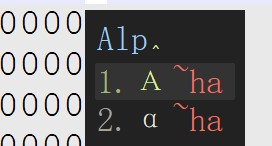
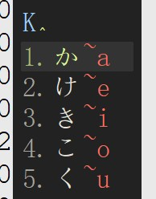
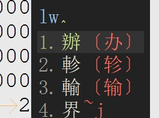
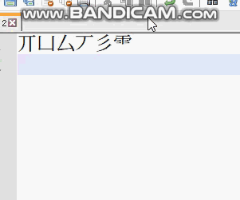
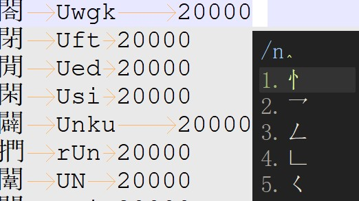
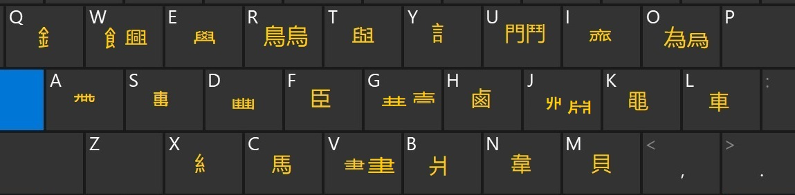
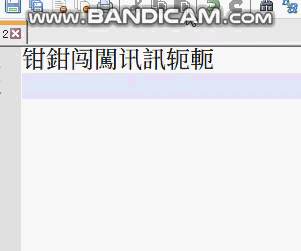
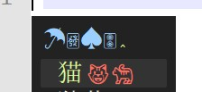
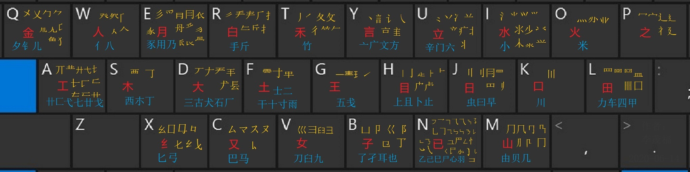

# rime_X_dict
rime extention dictionarys &amp; schema

# ① cof_punctuator
符号输入方案，输入日文时不用切换大小写字母，按读音输入，每输入一个音节时供选择的都是平假名在上，片假名在下， 
可按分号键选择第二个候选字上屏，跟五笔的习惯一样。

# ② wubi86_cof
### 五笔86版的cof扩展方案 ，扩展内容如下：
1. 在五笔86的基础上增加了cof符号输入法，直接按下大写字母开头的编码即可打出符号，含日文，希腊字母，其他符号 
  
  
2. 按下Shift+space可以切换简体与繁体（是指输简得繁）的开关。 
开启输简得繁后： 
  
3. 按下/键后，输入单个小写字母可列出该字母对应的五笔字根部件 
  
#  
4. 增加了繁体部件字根，按大写字母即可输入特定繁体部件字根，实现了繁体字的直接输入；增加的繁体部件字根如下： 
  
  Q		釒 
 W		興字头/飠 
 E		學字头 
 R		鳥，鳥字头/烏 
 T		與字頭 
 Y		訁 
 U		門 
 I		齊字头 
 O		爲去爫头/為无左上角的点 
 P		龍 
 A		帶字头 
 S		𡸸擊的左上角 
 D		豐字头 
 F		臣 
 G		冓字头/，穀字左上角部件 
 H		鹵 
 J		𢇇字底/肅字下面无竖，淵的右边 
 K		黽/𠀐，贵字头 
 L		車 
 M		貝 
 N		韋 
 B		爿 
 V		⺻/書字头 
 C		馬 
 X		糹 
  繁体字根打字示范：  
   
 
 5. 增加颜文字滤镜功能，当有颜文字提示时，按下Enter键输入颜文字，按下空格键则是候选字/词上屏
   
   
 ## 五笔86版字根（超全）
    

