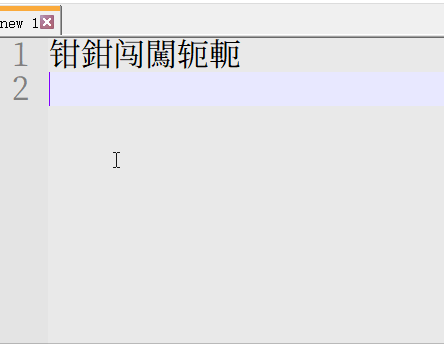

# rime_X_dict
rime extention dictionarys &amp; schema

# ① cof_punctuator
符号输入方案，输入日文时不用切换大小写字母，按读音输入，每输入一个音节时供选择的都是平假名在上，片假名在下， 
可按分号键选择第二个候选字上屏，跟五笔的习惯一样。

# ② cof_network
网络ip地址转换方案，IP地址转换成十六进制数，ip地址转二进制数，十六进制转10进制，二进制转十进制 
dec.→hex  
dec,→bin  
hex/→dec.  
bin-→dec.  
  

# ③ wubi86_cof
### 五笔86版的cof扩展方案 ，扩展内容如下：
1. 在五笔86的基础上增加了cof符号输入法，直接按下大写字母开头的编码即可打出符号，含日文等其他符号 
  

2. 按下Control+f 可以切换简体与繁体（是指输简得繁）的开关。 
  
3. 按下/键后，输入单个小写字母可列出该字母对应的五笔字根部件 
  
4. 增加了繁体部件字根，按大写字母即可输入特定繁体部件字根，实现了繁体字的直接输入； 
增加的词库文件wubi86_cof_cap.dict.yaml 
增加的繁体部件字根如下： 
  
  Q		釒 
 W		興字头/飠 
 E		學字头 
 R		鳥，鳥字头/烏 
 T		與字頭 
 Y		訁 
 U		門 
 I		齊字头 
 O		爲去爫头/為无左上角的点 
 P		龍 
 A		帶字头 
 S		𡸸擊的左上角 
 D		豐字头 
 F		臣 
 G		冓字头/，穀字左上角部件 
 H		鹵 
 J		𢇇字底/肅字下面无竖，淵的右边 
 K		黽/𠀐，贵字头 
 L		車 
 M		貝 
 N		韋 
 B		爿 
 V		⺻/書字头 
 C		馬 
 X		糹 
  繁体字根打字示范：  
   
 
 5. 增加颜文字滤镜功能，按Control+e开启，当有颜文字提示时，按下Enter键输入颜文字，按下空格键则是 候选颜文字上屏
  , 滤镜文件：cof_trans.json 和 cof_trans.txt  
   
 
 6. 增加字符编码（16进制）提示，按下control+g提示单字gbk编码，按下control+u提示单字unicode编码 
 滤镜文件：gbk_code.json 和 gbk_code.txt ; Utf16_code.json 和 Utf16_code.txt 
 默认已提示cjk字符的分区，以及unicode的10进制编码 
 
 
 7. 增加单字 现代汉语拼音提示，按下Control+p开启 
 滤镜文件：pinyin.json 和 pinyin.txt  

 
 8. 增加实时日期及时间星期的提示（直接打 日期，时间，星期） 

 
 ## 五笔86版字根
    

